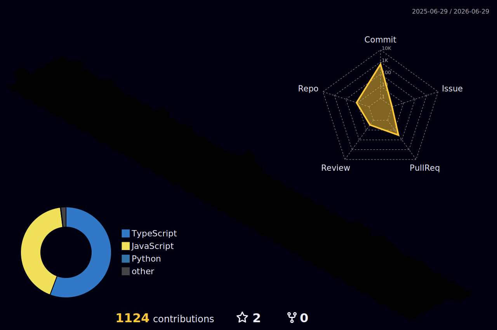

# Hey there, I'm Victor Leça!

**Computer Scientist | Full Stack Developer | Digitalization & AI** 

  

🎓 I am a **Computer Scientist** and Full Stack Developer with 5 years of experience in the tech industry. I am currently part of the **Digitalization & AI** team at LongPing High-Tech, focusing on building high-performance, scalable web applications and automating complex corporate operations alongside international teams.

I specialize in the **JavaScript/TypeScript ecosystem** and actively use AI-driven development tools (Claude, Cursor, Copilot) to accelerate delivery, maintain clean architecture, and ensure high-quality code. 

---

## 🚀 Tech Stack & Tools

- **Frontend & Mobile:** ReactJS, Next.js (SSR/SSG), React Native, TypeScript, Tailwind CSS, Vite.
- **Backend & Databases:** Node.js (Express), Python (FastAPI), RESTful APIs, GraphQL, PostgreSQL, DynamoDB.
- **AI & Productivity:** Claude Code, Cursor, GitHub Copilot, Gemini, MCP.
- **DevOps & Automation:** Docker, CI/CD (GitHub Actions), AWS/GCP, Power Platform (Power Apps, Power Automate).

---

## 📌 Featured Projects

| Project | Description | Tech Stack | Links |
|--------|-------------|------------|-------|
| **MarcaAí / People OS** | Premium SaaS scheduling platform for B2B teams featuring customized onboarding, online payments, and Google Calendar integrations. | Next.js 15, TypeScript, Tailwind v4, PostgreSQL, Stripe | [🔗 Repo](https://github.com/vLecaBR/marcaAi) |
| **Sales Website Model** | A complete, scalable template for e-commerce platforms featuring secure JWT authentication and a full admin dashboard. | React, Node.js, PostgreSQL, AdminJS | [🔗 Front](https://github.com/vLecaBR/sales-website-model) [🔗 Back](https://github.com/vLecaBR/sales-website-backend) |
| **Eastqg App** | Full-stack mechanic service application built with a decoupled architecture and dynamic API-based product structure. | React, Node.js, Express, Styled Components | [🔗 Repo](https://github.com/vLecaBR/eastqg) [🌐 Live](https://eastqg.vercel.app/) |
| **Leca3D Platform** | High-performance landing page for a 3D printing service, optimized for SEO and rapid loading times. | React, Vite, TypeScript, Tailwind CSS | [🌐 Live](https://www.leca3d.com.br) |

---

## 💼 Current Experience

**Front-End / Full Stack Developer | Digitalization & AI @ Long Ping High-Tech** *Liderança técnica no desenvolvimento de aplicações web e mobile utilizando ReactJS e Node.js. Implementação de fluxos de trabalho otimizados por IA (GenAI) para automação e refatoração de código legado, reduzindo o tempo de entrega de projetos em 65%.*

---

## 🔥 GitHub Streak

---

## 📈 Contribution Activity

---

> *"Code is like humor. When you have to explain it, it’s bad." – Cory House*
