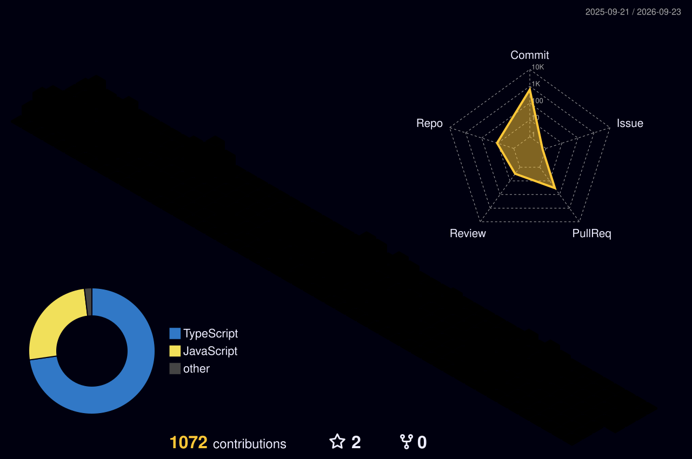

# Hey there, I'm Victor Leça!

**Computer Scientist | Full Stack Developer | .NET & Node.js Ecosystem** 

  

🎓 I am a **Computer Scientist** and Full Stack Developer with 5 years of experience in the tech industry. I am currently acting as a Full Stack Developer (Digitalization & AI) at LongPing High-Tech, focusing on building high-availability RESTful APIs, microservices, and scalable web applications alongside international teams.

I specialize in both the **.NET/C#** and **JavaScript/TypeScript** ecosystems. I actively use AI-driven development tools (Claude, Cursor, Copilot, Gemini) to accelerate delivery, refactor legacy code, and maintain a clean, resilient architecture (SOLID, CQRS). 

---

## 🚀 Tech Stack & Tools

- **Backend & Architecture:** C#, .NET Core / .NET 8, ASP.NET Core, Entity Framework Core, Node.js (Express), Microservices, RESTful APIs.
- **Frontend & Mobile:** ReactJS, Next.js (App Router/Server Components), TypeScript, Tailwind CSS, Vite, Angular.
- **Databases & Messaging:** SQL Server, PostgreSQL, MongoDB, Redis, RabbitMQ, Kafka.
- **AI & Productivity:** Claude Code, Cursor, GitHub Copilot, Gemini, MCP, n8n.
- **Cloud, DevOps & Automation:** Docker, Kubernetes, CI/CD, AWS, Azure, Power Platform (Power Apps, Power Automate).

---

## 📌 Featured Projects

| Project | Description | Tech Stack | Links |
|--------|-------------|------------|-------|
| **MarcaAí** | Premium SaaS scheduling platform for B2B teams featuring customized onboarding, online payments, and Google Calendar integrations. | Next.js 15, React 19, TypeScript, Tailwind v4, PostgreSQL, Stripe | [🔗 Repo](https://github.com/vLecaBR/marcaAi) |
| **Sales Website Model** | A complete, scalable template for e-commerce platforms featuring secure JWT authentication and a full admin dashboard. | React, Node.js, PostgreSQL, AdminJS | [🔗 Front](https://github.com/vLecaBR/sales-website-model) [🔗 Back](https://github.com/vLecaBR/sales-website-backend) |
| **Eastqg App** | Full-stack mechanic service application built with a decoupled architecture and dynamic API-based product structure. | React, Node.js, Express, Styled Components | [🔗 Repo](https://github.com/vLecaBR/eastqg) [🌐 Live](https://eastqg.vercel.app/) |
| **Leca3D Platform** | High-performance landing page for a 3D printing service, optimized for SEO and rapid loading times. | React, Vite, TypeScript, Tailwind CSS | [🌐 Live](https://www.leca3d.com.br) |

---

## 💼 Current Experience

**Full Stack Developer Pleno | Digitalization & AI @ LongPing High-Tech**
*Architecting and maintaining high-availability REST APIs with C# (ASP.NET Core) and Node.js in a microservices environment. Building dynamic interfaces with React and Next.js. Implementation of AI-optimized workflows (GenAI) for automation, RPA orchestration (n8n/Python), and legacy code refactoring, reducing project delivery time by approximately 65%.*

---

## 🔥 GitHub Streak

---

## 📈 Contribution Activity

---

> *"Code is like humor. When you have to explain it, it’s bad." – Cory House*
