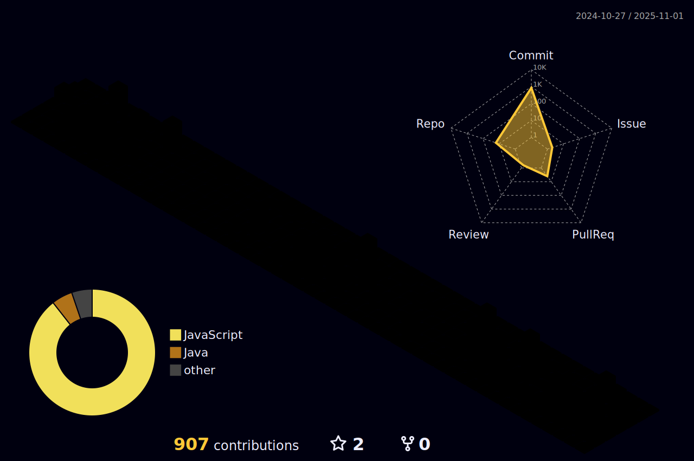

# Hey there, I'm Victor Leça! 👋

🎓 I'm a **Computer Science** student with a background in technical support and IT infrastructure in multinational companies. Currently, I work in **automation and web development**, building web apps and internal tools using:

- **React.js**, **TailwindCSS**, **Node.js**
- **Power Platform (Power Apps / Power Automate)**
- **SharePoint integrations** for corporate solutions

I'm passionate about clean code, UI/UX, and learning new technologies. I thrive in environments that challenge me to build creative, scalable, and impactful products.

## 🚀 Tech Stack & Tools

- **Languages:** JavaScript, TypeScript, HTML, CSS, Python
- **Frameworks/Libraries:** React, Next.js, Svelte, Node.js, Django
- **UI/Styling:** Tailwind CSS, Sass, Figma
- **Platforms:** Power Apps, Power Automate, Office 365, SharePoint
- **Tools:** Git, GitHub, VS Code
- **DataBase:** SQLite, Postgresql
- **Currently Exploring:** Java, React Native, NextJS and VueJS.

## 📌 Featured Projects

| Project | Description | Tech Stack | Link |
|--------|-------------|------------|------|
| **EastQG** | Modern sales and mechanic services | React, JavaScript, Styled Components | [🔗 View](https://github.com/vLecaBR/eastqg) |
| **EastQG-Backend** | Backend using MLapi to show products | Node.js, Express, API Rest | [🔗 View](https://github.com/vLecaBR/eastqg_backend) |
| **DJ Franzoni** | DJ Portfolio and contact system for bookings | React, JavaScript, Styled Components | [🔗 View](https://github.com/vLecaBR/djfranzoni-portfolio) |
| **My portfolio** | Personal portfolio and showcase | React, TypeScript, TailwindCSS | [🔗 View](https://github.com/vLecaBR/victorleca_portfolio) |

## 📊 GitHub Stats

---

## 📈 Contribution Activity

## 💬 Let's Connect

Feel free to reach out or just say hi 👋:

      

---

> “Code is like humor. When you have to explain it, it’s bad.” – Cory House

Thanks for stopping by! 😄
